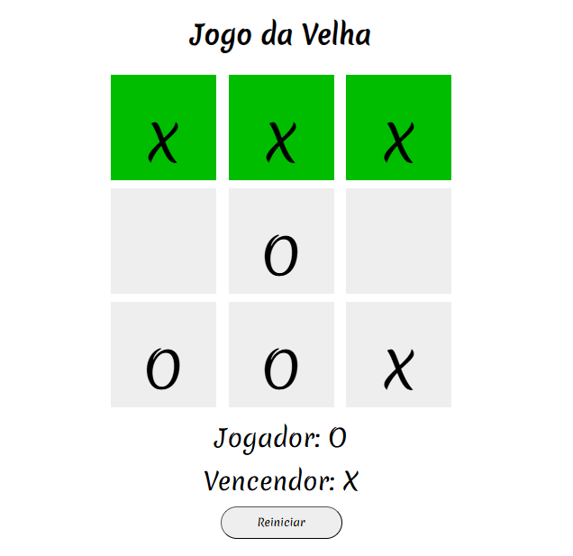

# ❌⭕ Jogo da Velha (Tic Tac Toe)

Este projeto é uma implementação do clássico **Jogo da Velha**, criado com **HTML**, **CSS** e **JavaScript puro**. Foi desenvolvido com o objetivo de praticar lógica de programação, manipulação do DOM e eventos de clique.


---

## 🎯 Como Jogar

- Dois jogadores se alternam marcando os espaços em um tabuleiro 3x3.
- O primeiro jogador usa "X" e o segundo usa "O".
- Vence quem alinhar três símbolos na horizontal, vertical ou diagonal.
- Se todos os espaços forem preenchidos sem um vencedor, o jogo termina em empate.

**Link para jogar:** [https://mariana-nogueira21/jogo-da-velha/](https://mariana-nogueira21.github.io/jogo-da-velha/)

---

## 🚀 Tecnologias Utilizadas

- **HTML5**: estrutura da interface
- **CSS3**: estilização, responsividade e efeitos visuais
- **JavaScript**: regras do jogo, verificação de vitória, alternância de turnos e reinício da partida

---

## 📁 Como Executar

1. Clone este repositório:
   ```bash
   git clone https://github.com/mariana-nogueira21/jogo-da-velha.git
